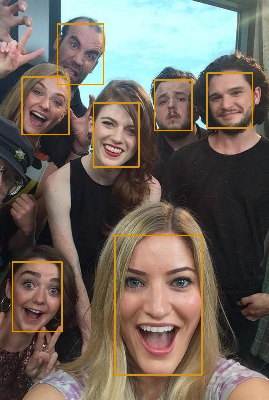
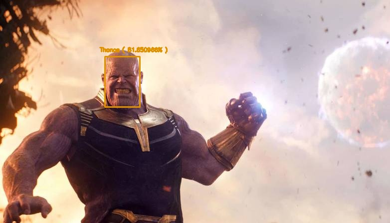

# DeepStackPython

Official Python SDK for DeepStack

# DeepStack

(DeepStack)[https://deepstack.cc] is an AI server that allows deploying object detection, face detection, face recognition, scene recognition and detection of custom objects on the edge and in production servers.
DeepStack Runs on Docker, Windows, Linux, Mac and Nvidia Jetson devices.
And it is entirely free and Open Source

The DeepStack Python SDK makes it easy to perform all of the above awesome AI magic on Images and Videos in few lines of code,
Just Install DeepStack and the Python SDK and you are good to go!

# Installation Instructions

## Install DeepStack on Windows

You can install DeepStack via docker on windows, note that this does not support GPU acceleration

`docker pull deepquestai/deepstack:cpu-2021.02.1`

You can also install the Native Windows Version of DeepStack, this supports GPU acceleration

#### CPU Version

Download and run [DeepStack CPU Installer](https://github.com/johnolafenwa/DeepStack/releases/download/0.2-beta/DeepStack-Installer-CPU.2021.01.beta.exe)

### GPU Version

- Download and Install CUDA 10.1 from here https://developer.nvidia.com/cuda-10.1-download-archive-base
- Download and install Cudnn from here https://developer.nvidia.com/cudnn'
- Download and run [DeepStack GPU Installer](https://github.com/johnolafenwa/DeepStack/releases/download/0.2-beta/DeepStack-Installer-GPU.2021.01.beta.exe)

## Install DeepStack on Linux

Linux Support is via Docker, hence you must install docker first

`sudo apt-get update && sudo apt-get install docker.io`

### CPU Version

`sudo docker pull deepquestai/deepstack:cpu-2021.02.1`

### GPU Version

`sudo docker pull deepquestai/deepstack:gpu-2021.02.1`

## Install DeepStack on MacOS

MacOS support is via Docker, install docker on Mac and run

`sudo docker pull deepquestai/deepstack:cpu-2020.02.1`
Note that GPU acceleration is not available for Mac at the moment

## Install DeepStack on Nvidia Jetson

`sudo docker pull deepquestai/deepstack:jetpack-2021.02.1`

# Install DeepStack Python SDK

`pip3 install deepstack-sdk`

# Examples

## Object Detection

1. Run DeepStack Object Detection API

   - Docker CPU: `docker run -e VISION-DETECTION=True -v localstorage:/datastore -p 80:5000 deepquestai/deepstack`

   - Docker GPU: `sudo docker run --gpus all -e VISION-DETECTION=True -v localstorage:/datastore -p 80:5000 deepquestai/deepstack:gpu`

   - Windows CPU & GPU: `deepstack --VISION-DETECTION True --PORT 80`

   - NVIDIA Jetson: `sudo docker run --runtime nvidia -e VISION-DETECTION=True -p 80:5000 deepquestai/deepstack:jetpack`

2. Sample code

   
    <pre>
    from deepstack_sdk import ServerConfig, Detection
   
    config = ServerConfig("http://localhost:80")
    detection = Detection(config)
   
    response = detection.detectObject("detection.jpg",output="detection_output.jpg", draw_bounding_box=True,show_label=True,show_conf=True)
   
    for obj in response:
        print("Name: {}, Confidence: {}".format(obj.label, obj.confidence))
   
    </pre>

   Result

   

3) Find more code samples in [examples](examples/) folder of this repository.

## Face

1. Run DeepStack Face API

   - Docker CPU: `docker run -e VISION-FACE=True -v localstorage:/datastore -p 80:5000 deepquestai/deepstack`

   - Docker GPU: `sudo docker run --gpus all -e VISION-FACE=True -v localstorage:/datastore -p 80:5000 deepquestai/deepstack:gpu`

   - Windows CPU & GPU: `deepstack --VISION-FACE True --PORT 80`

   - NVIDIA Jetson: `sudo docker run --runtime nvidia -e VISION-FACE=True -p 80:5000 deepquestai/deepstack:jetpack`

2. Sample code: **Face Detection**

   
    <pre>
    from deepstack_sdk import ServerConfig, Face
   
    config = ServerConfig("http://localhost:80")
    face = Face(config)
   
    response = face.detectFace("got.jpg",output="got_detected.jpg")
   
    for obj in response:
        print("Face Detected, Confidence: {}".format(obj.confidence))
   
    </pre>

   

3. Sample code: **Face Recognition**

   i. Register Face
   

    <pre>
    from deepstack_sdk import ServerConfig, Face
   
    config = ServerConfig("http://localhost:80")
    face = Face(config)
   
    images = ["thanos.jpg"]
    response = face.registerFace(images=images,userid="Thanos")
    print(response)
    </pre>

   ii. Perform Face Recognition
   

    <pre>
    from deepstack_sdk import ServerConfig, Face
   
    config = ServerConfig("http://localhost:80")
    face = Face(config)
   
    response = face.recognizeFace(image=r"thanos2.jpg", output="face_recognized.jpg",draw_bounding_box=True,show_label=True,show_conf=True)
    print(response)
    </pre>

   

3) Find more code samples in [examples](examples/) folder of this repository.
